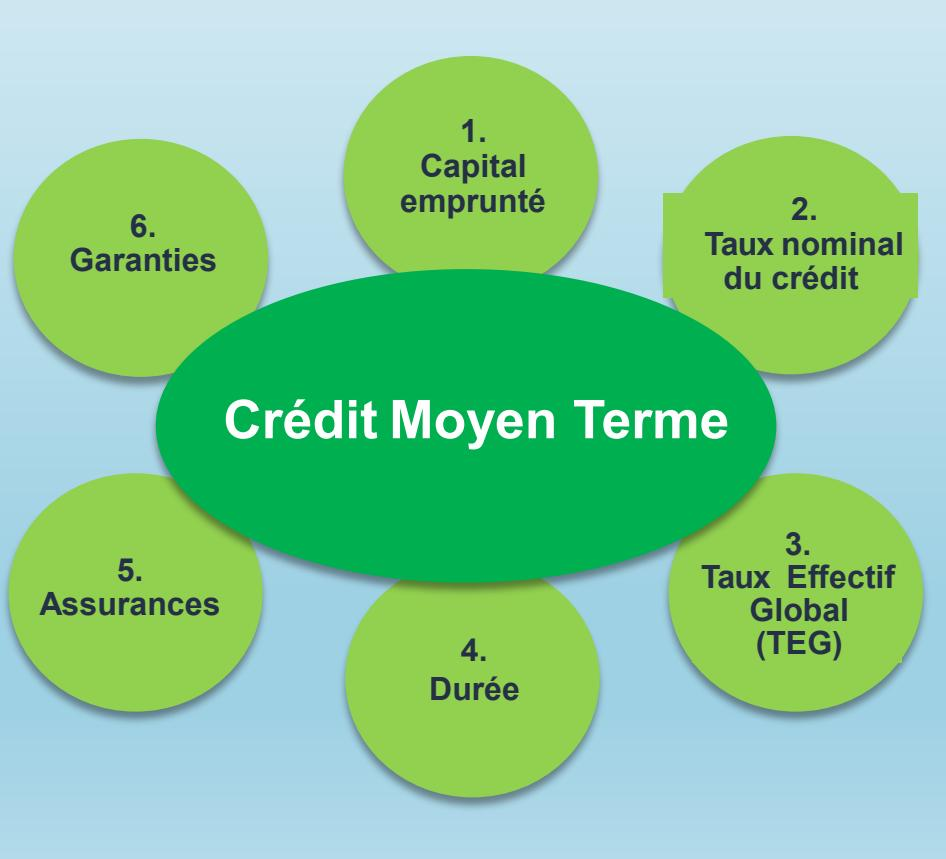

[B-PAGE] ## --- Page 1 --- 
[B-TITLE] Formation Métiers
[I-TITLE] du financement
[O] Septembre 2024
[B-IMGCAP] 

[B-PAGE] ## --- Page 2 --- 
[B-SECTION] __Plan formation Métier__
[B-SUBSECTION] 1.Objectifs
[B-BULLETLIST] Avoir une définition claire de ce que s’est un crédit
[B-BULLETLIST] Découvrir les différents paramètres qui interviennent dans la mise en place d’un crédits,
[B-BULLETLIST] Savoir les différents types d’amortissement d’un crédit
[B-BULLETLIST] Découvrir les différents types de crédits et les différences de montage et de gestion courante

[B-PAGE] ## --- Page 3 --- 
[B-SECTION] Plan:
[O] AGENDA
[B-ENUMITEM] 1️- Définitions des Crédits
[B-ENUMITEM] 2️- Les Différents Types de Crédit
[B-ENUMITEM] 3️- Les Crédits Classiques
[B-ENUMITEM] 4️- Le Leasing
[B-ENUMITEM] 4.1 Principe du Leasing
[B-ENUMITEM] 4.2 Leasing vs Crédits
[B-ENUMITEM] 4.3 Autres Types de Leasing
[B-ENUMITEM] 5️ Autres Produits Financiers
[B-ENUMITEM] 5.1 Le Crédit Révolving

[B-PAGE]## --- Page 4 --- 
[B-SECTION] Qu’est ce qu’un crédit? 
[B-CHAPTER] Introduction
[B-BULLETLIST] On dit « Avoir du crédit », « Accorder du crédit à », « Jouir d’un crédit auprès de quelqu’un »
[B-BULLETLIST] Ces expressions en français renvoient toutes à une notion decroyance, de crédibilité, de confiance.
[B-BULLETLIST] Une opération de crédit est donc fondée sur la croyance du créancier que le débiteur sera en mesure de payer sa dette à l’échéance.
[B-BULLETLIST] Il s’agit fondamentalement d’un acte de confiance du prêteur envers l’emprunteur.

[B-PAGE] ## --- Page 5 --- 
[B-SECTION] Qu’est ce qu’un crédit
[B-ENUMITEM] L’acte de crédit correspond à un engagement de deux parties pour :
[B-BULLETLIST] Prêter à un tiers une somme d’argent selon des modalités prédéfinies dans l’acte de prêt
[B-BULLETLIST] C’est l’engagement du prêteur
[B-BULLETLIST] Rembourser au prêteur les sommes dues selon les conditions acceptées dans l’acte de prêt
[B-BULLETLIST] C’est l’engagement de l’emprunteur
[B-ENUMITEM] Cet engagement est concrétisé par la signature d’une offre de prêt/contrat de
prêt:
[B-BULLETLIST] La distinction des termes utilisés renvoie aux modalités juridiques de conclusion définitive des engagements des parties
[B-BULLETLIST] Le financement des particuliers est couvert par des lois ( En France :Scrivener 1, Lagarde, Etc…) : le prêteur émet le contrat de prêt;
[B-BULLETLIST] Le financement des personnes morales n’est pas couvert de contraintes restrictives: le prêteur émet un contrat de prêt

[B-PAGE] ## --- Page 6 --- 
[B-CHAPTER] Notions de base 
[B-SECTION] Les paramètres de bases d’un crédit 
[O] Financièrement, un crédit moyen terme s’appuie sur différentes variables qui le component
[B-BULLETLIST] Capital emprunté: 
[I-BULLETLIST] Montant du crédit consenti par le prêteur. Le capital peut être versé en une ou plusieurs fois.
[B-BULLETLIST] Taux nominal: 
[I-BULLETLIST] Taux de base qui sert au calcul des intérêts sur un prêt ou sur un placement. Il  peux être fixe ou variable
[B-BULLETLIST] Taux Effectif Global: 
[I-BULLETLIST] Taux qui intègre en sus des intérêts l’ensemble des frais obligatoires pour l’obtention du prêt, connus ou estimés :
[B-BULLETLIST] les frais de  dossier  
[B-BULLETLIST] les primes d’assurance obligatoire 
[B-BULLETLIST] les frais  de garanties. 
[O]En France, le TEG du prêt ne doit pas dépasser le seuil de l’usure. Pour un  prêt à taux variable, le TEG figurant dans le contrat de prêt est donné à titre indicatif en fonction des informations connues au moment de  l’édition de ce contrat de prêt.
[B-BULLETLIST] Durée: 
[I-BULLETLIST] Elle est déterminée au contrat et peut être fixe ou variable. En général, la variation de la durée peut résulter soit de la révision du taux d’intérêt soit du report ou de la modulation volontaire de l’échéance par l’emprunteur.
[B-BULLETLIST] Assurances: 
[I-BULLETLIST] Dénommée parfois ADI. Contrat qui garantit le  remboursement total ou partiel du crédit en cas de décès ou de maladie. Très souvent exigée par la banque.
[B-BULLETLIST] Garanties: 
[I-BULLETLIST] Engagement donné ou reçu, pour assurer le paiement d’une dette ou créance. On distingue les garanties personnelles (ex : cautionnement) et les garanties réelles (ex : hypothèque)

[B-IMGCAP] 

[B-PAGE] ## --- Page 7 --- 
[B-CHAPTER]Notions de base 
[B-SECTION] Principe général d’amortissement
[B-BULLETLIST] Capital emprunté:
[O] Montant du crédit consenti par le prêteur. Le capital peut être verséen une ou plusieurs fois.
[B-BULLETLIST] Amortissement:
Remboursement prévu en une ou
plusieurs fois d’un emprunt.
Selon le type d’emprunt, il peut être
étalé dans le temps ou effectué en une
Capital restant dû
seule fois en fin de contrat.
Montant du capital restant à
rembourser par l’emprunteur à une
date donnée. Il sert debase au calcul
des intérêts de l’échéance àvenir.

[B-PAGE] ## --- Page 8 --- 
[B-CHAPTER]Notions de base… Les techniques d’amortissement
Amortissement par échéances/annuités constantes
L’amortissement avec annuités constantes est la formule la plus souvent rencontrée à l’occasion des remboursements de
crédits. La part des intérêts dans un amortissement avec annuités constantes est plus élevée au départ. Elle va ensuite
diminuer régulièrement tandis que celle du capital remboursé va progressivement augmenter.
Amortissement à capital constant
Le principe de ce mode d'amortissement est que la part de capital remboursée à chaque échéance est la même pendant
toute la durée de l'emprunt.
Ce type d’amortissement est appelé amortissement constant ou linéaire du crédit.
Amortissement « in fine »
L’amortissement in fine implique que pendant toute la durée du crédit, l'emprunteur ne paie que les intérêts.
L'emprunteur rembourse la totalité du capital, en une seule fois à la dernière échéance.
Les intérêts payés sont constants puisqu’ils sont calculés sur le capital total emprunté.

